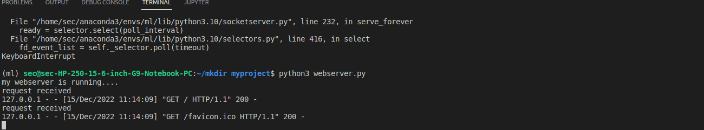
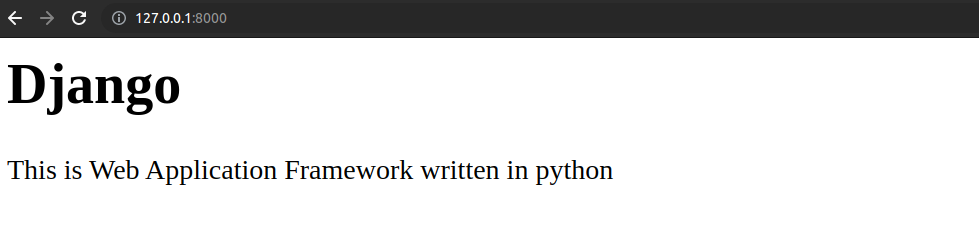

# Developing a Simple Webserver

# AIM:

To develop a simple webserver to serve html programming pages.

## DESIGN STEPS:

### Step 1:

HTML content creation is done

### Step 2:

Design of webserver workflow

### Step 3:

Implementation using Python code

### Step 4:

Serving the HTML pages.

### Step 5:

Testing the webserver

## PROGRAM:
<!DOCTYPE phtml>
<html>
<head>
<title>Django</title>
</head>
<body>

<h1>Django</h1>

This is Web Application Framework written in python

</body>
</html>

## OUTPUT:
## SERVER OUTPUT:

## CLIENT OUTPUT:

## RESULT:
The program is executed succesfully
